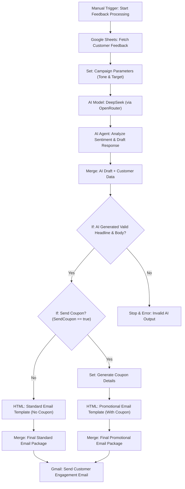

# Customer Feedback & Engagement Workflow

This repository contains an intelligent n8n workflow designed to automate customer feedback analysis and personalized email responses for businesses. It uses AI to understand customer sentiment, drafts a culturally appropriate response, and can automatically generate and send a promotional coupon via Gmail if the feedback warrants it.

---

## 🧠 Workflow Summary

This workflow is triggered manually and performs the following:

1.  **Fetches customer feedback data** from a Google Sheet.
2.  **Sets the campaign's tone and target** (configured for a warm, friendly Nigerian style).
3.  **Leverages the DeepSeek AI model** (via OpenRouter) to analyze the sentiment of the product feedback.
4.  **Generates a personalized email response** including a headline, body, and a decision on whether to send a coupon.
5.  **Validates the AI's output** to ensure quality and prevent errors.
6.  **Branches based on the coupon decision:**
    -   **If no coupon:** Builds a standard "thank you" email.
    -   **If coupon needed:** Generates coupon details and builds a promotional email.
7.  **Sends the final, professionally styled HTML email** directly to the customer via Gmail.

---

## 🗂️ Workflow Architecture



---

## 🔧 Technologies Used

| Tool          | Purpose                      |
|---------------|------------------------------|
| n8n           | Workflow automation engine   |
| Google Sheets | Customers' feedback          |
| OpenRouter	| Large Language Model (LLMs)  |
| DeepSeek AI	| Workflow automation engine   |
| Gmail         | Send email to the customers  |

---

## 📊 Google Sheets Structure

The workflow expects a sheet with at least the following columns:
- **Customer Name** – The name of the customer.   
- **Email** – The customer's email address.  
- **Item Purchased** – The product they bought.  
- **Feedback** – The raw text of their product feedback.  

---

## ✉️ AI-Powered Email Output

The workflow generates rich, responsive HTML emails. Here is an example based on the provided data:

```text
**Subject:** Well Done, Oluwalowo! Thanks for Your Feedback on Our Shea Butter Moisturizer.

📦 **Body**


**Hello Oluwalowo,**
Well done, our dear customer! Thank you so much for your honest feedback on our **Shea Butter Moisturizer**. We are so happy to hear you love the smooth texture – that's our pride!

We also hear you loud and clear on the scent fading too quickly; no worries, we are on the case to make it last from morning till your owambe party finishes! Our product team is already working on a new, long-lasting formula.

As a thank you for helping us improve, please enjoy this special discount on your next order.

<div class="coupon"> <h3>Here's a Gift for You!<br>20% off your next purchase!</h3> <h4 class="code">NNGIFT08-429</h4> <p>Valid until 11. Sep. 2025 | Minimum purchase: ₦20,000</p> </div>

**Tolu John Essentials Ltd.**
Suite 5, Plaza Complex, Central Business District, FCT-Abuja, Abuja, Nigeria.
+234 703 073 9128 | support@tjessentials.com
```

---

## 📊 Sample Data
Use this file to simulate the workflow locally:
- [Customer data Sheet](sample-data/inventory-sheet.csv)

---

## 🛠️ Setup & Installation Instructions
### Prerequisites
1. A running n8n instance (cloud, desktop, or self-hosted).
2. Accounts and credentials for:
    ** **Google Sheets API** (with a prepared sheet)
    ** **OpenRouter API** (with credits)
    ** **Gmail API** (OAuth2)

### Import & Configuration
1. **Clone this repo** or download the ```workflow.json``` file.
2. **Import the workflow** into your n8n instance.
3. **Configure Credentials:**
    ** Set up a Google Service Account or OAuth2 for the ```Google Sheets``` node.
    ** Add your OpenRouter API key to the credentials.
    ** Connect your Gmail account via OAuth2.
4. **Update Resource IDs:**
    ** In the Google Sheets: Fetch Customer Feedback node, update the Sheet ID and Sheet Name to point to your customer data sheet.
    ** (Optional) Adjust the AI prompt in the AI Agent node to fine-tune the tone.
    ** Activate the workflow and test using the Execute Workflow button.

---

## 🧑‍💻 Author
OLUWALOWO John   
📧 oluwalowojohn@gmail.com   
🎨 [LinkedIn](https://linkedin.com/in/oluwalowojohn/)
    🐙 [GitHub](https://github.com/oluwalowojohn)

---

## 📄 License
This project is licensed under the MIT License. Feel free to fork, adapt, and contribute!

---

## 🙌 Contributions
Contributions, ideas, and bug reports are welcome! Feel free to fork this repository and submit a Pull Request.

If you have specific ideas for making the Nigerian tone even better or want to add support for other messaging platforms (e.g., WhatsApp via Twilio), please open an issue.
