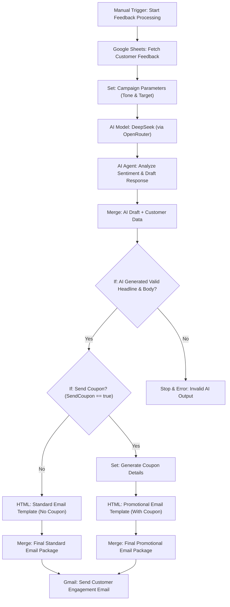

# 🧴 Nigerian-Standard Automated Customer Feedback & Engagement Workflow

This repository contains an intelligent n8n workflow designed to automate customer feedback analysis and personalized email responses for a Nigerian business. It uses AI to understand customer sentiment, drafts a culturally appropriate response, and can automatically generate and send a promotional coupon via Gmail if the feedback warrants it.

---

## 🧠 Workflow Summary

This workflow is triggered manually and performs the following:

1.  **Fetches customer feedback data** from a Google Sheet.
2.  **Sets the campaign's tone and target** (configured for a warm, friendly Nigerian style).
3.  **Leverages the DeepSeek AI model** (via OpenRouter) to analyze the sentiment of the product feedback.
4.  **Generates a personalized email response** including a headline, body, and a decision on whether to send a coupon.
5.  **Validates the AI's output** to ensure quality and prevent errors.
6.  **Branches based on the coupon decision:**
    -   **If no coupon:** Builds a standard "thank you" email.
    -   **If coupon needed:** Generates coupon details and builds a promotional email.
7.  **Sends the final, professionally styled HTML email** directly to the customer via Gmail.

---

## 🗂️ Workflow Architecture

